# Objective

Leverage Firebase to enhance a Next.js application with real-time capabilities and authentication. You'll set up Firebase in a Next.js project, implement Google Sign-In authentication, and handle user sessions.

# Instructions

## Part 1: Firebase Setup

### Firebase Project:

Create a Firebase project through the Firebase Console. Document the process with screenshots, specifically highlighting the creation of the project and enabling Google Analytics.
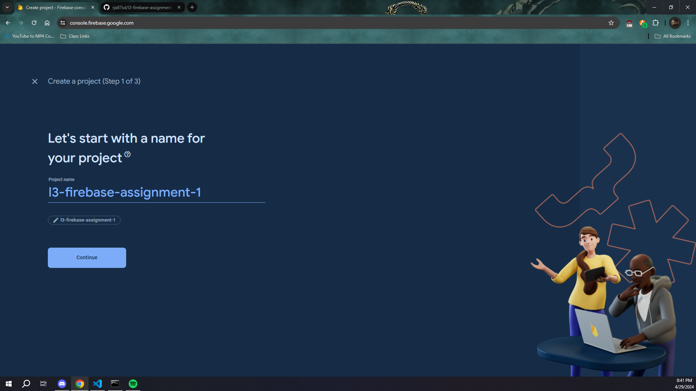
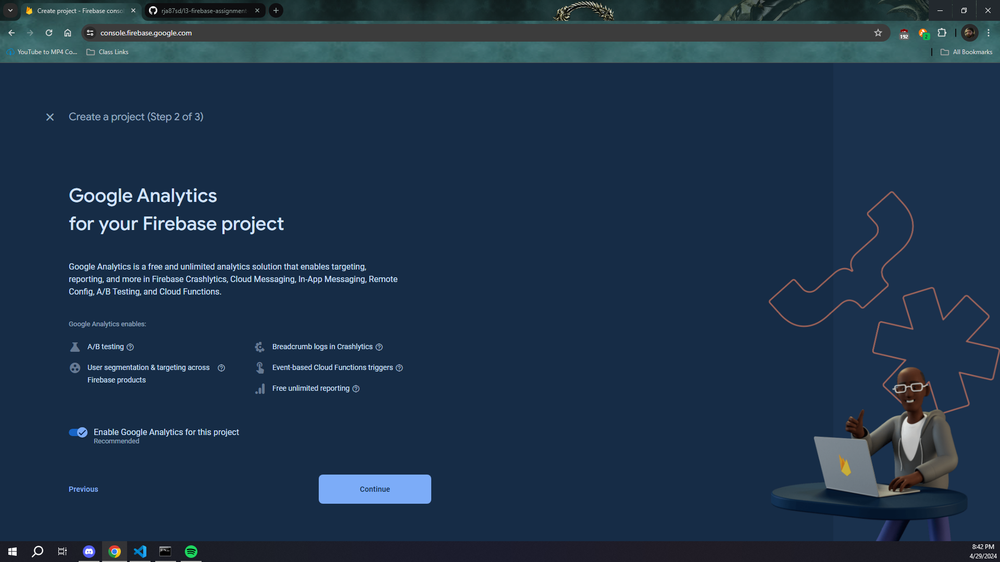
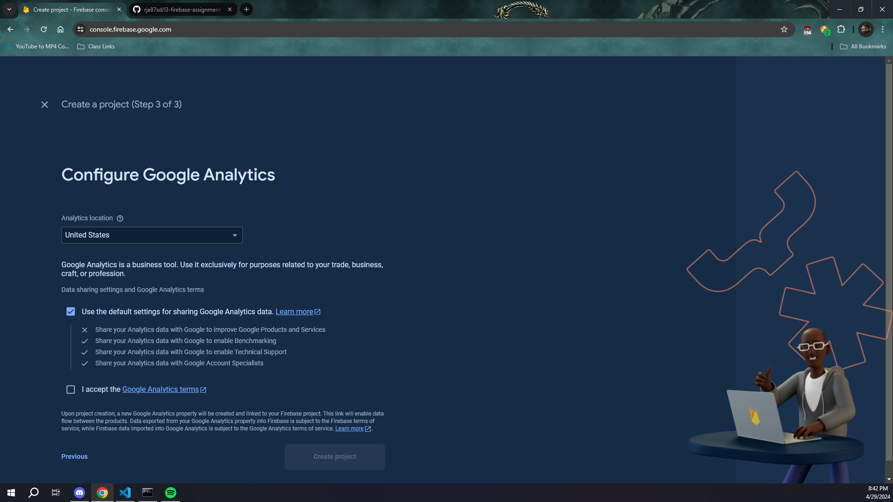
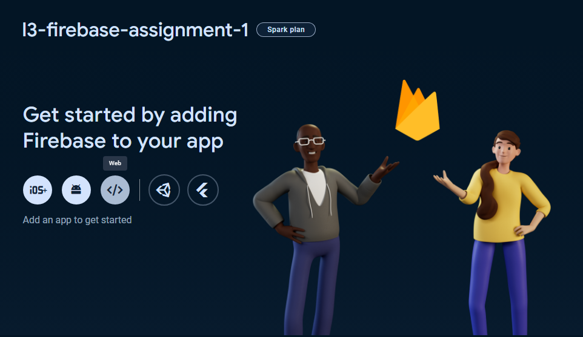
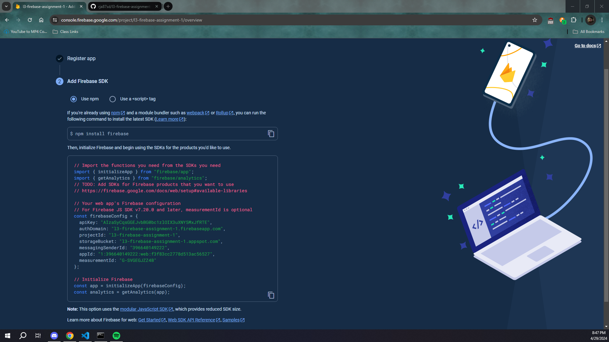

### Firebase SDK Installation:

Integrate Firebase into your Next.js application by installing the Firebase package. Use the provided npm install firebase command in your project directory.
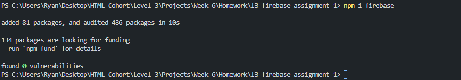

### Firebase Configuration:

Create a firebaseConfig.js file in your project. Store your Firebase project's configuration in this file.
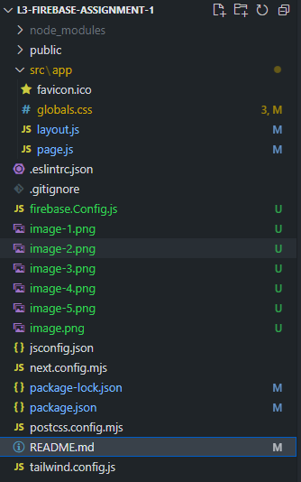

## Part 2: Implementing Authentication

### Google Sign-In:

Set up Google Sign-In method in your Firebase project. Capture this process with screenshots.
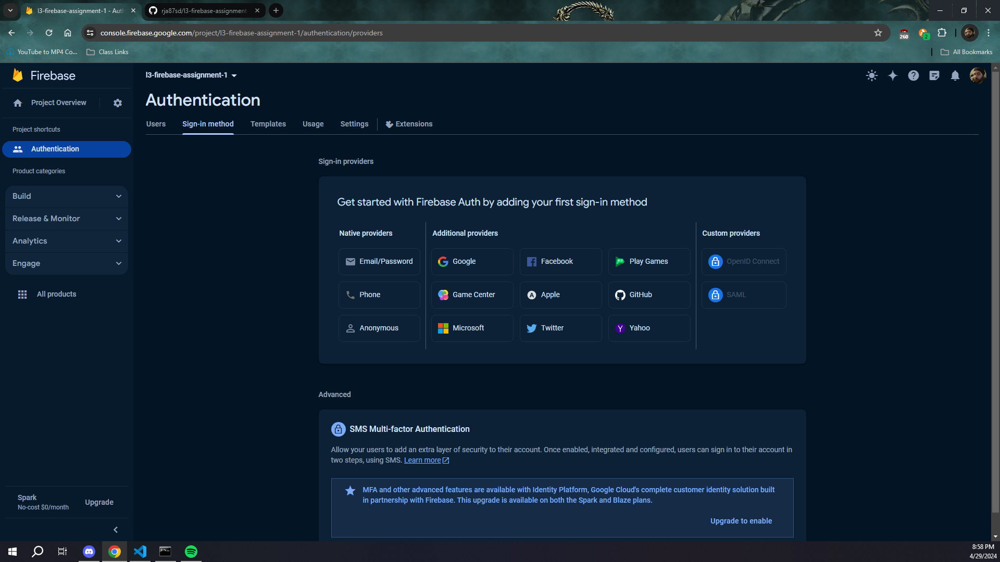
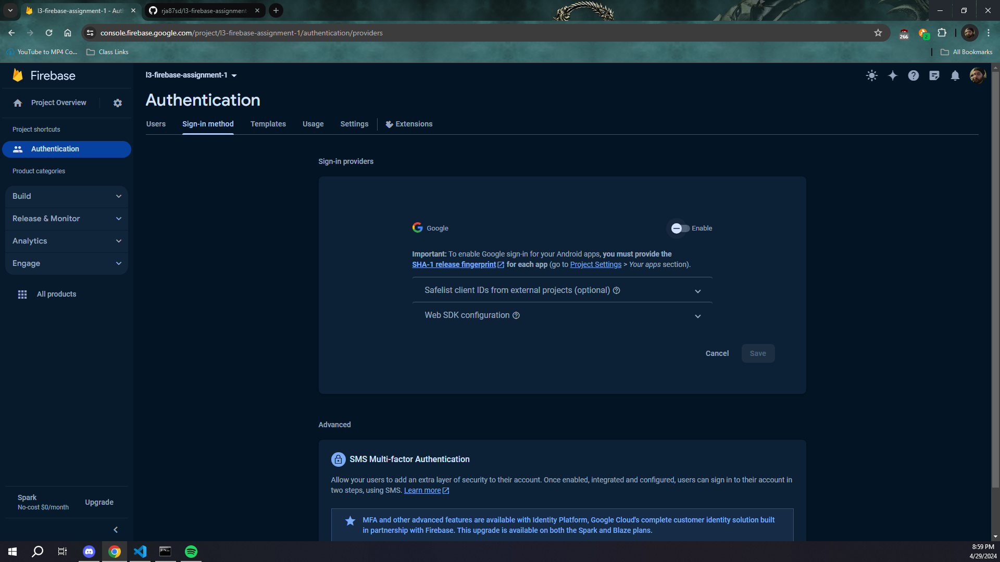
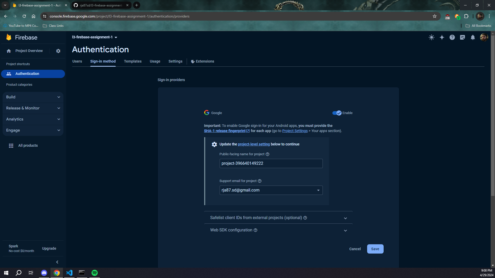
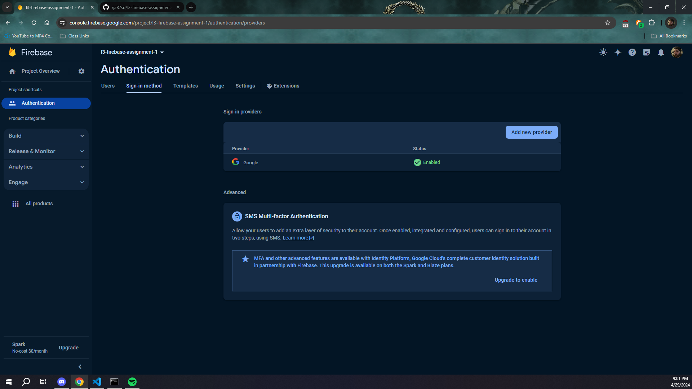

Implement a "Sign in with Google" button in your application that utilizes Firebase Authentication to sign in users.
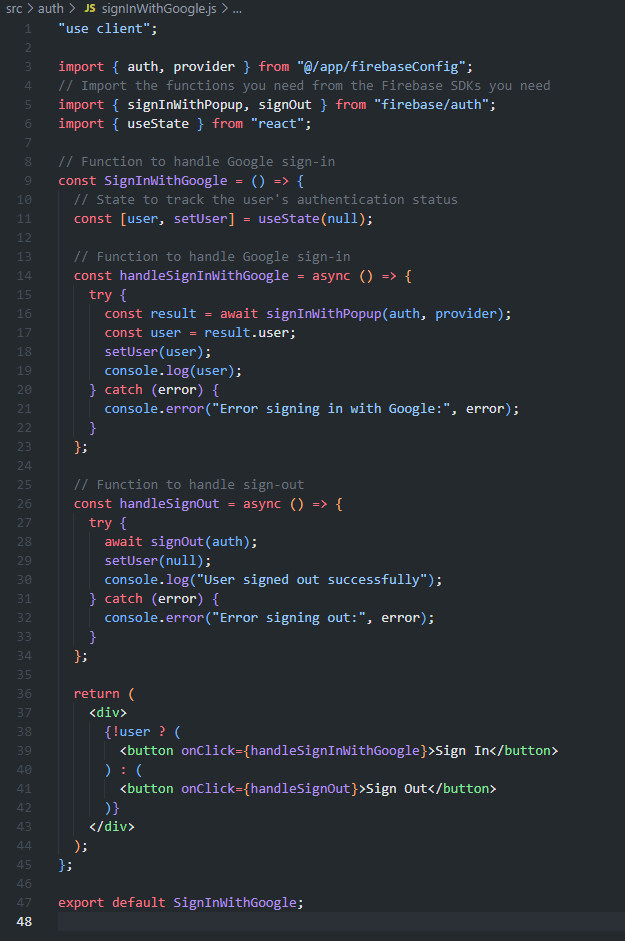

Use the firebaseAuth.js module from the demo code as a reference.

### Session Handling:

Implement functionality to observe the user's authentication state (signed in/out). Use the useAuth hook pattern provided in the demo code.

Display the user's name on the application's main page upon successful sign-in. If signed out, show a message indicating the user is not signed in.

## Part 3: Documentation and Submission

### Console Log and README.md:

Ensure actions such as signing in and signing out are logged to the console.

Capture a successful sign-in screen as a screenshot. Include this image in your README.md.
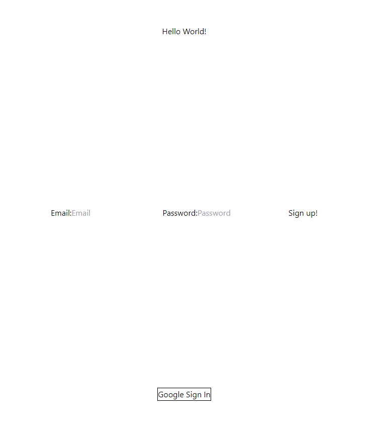
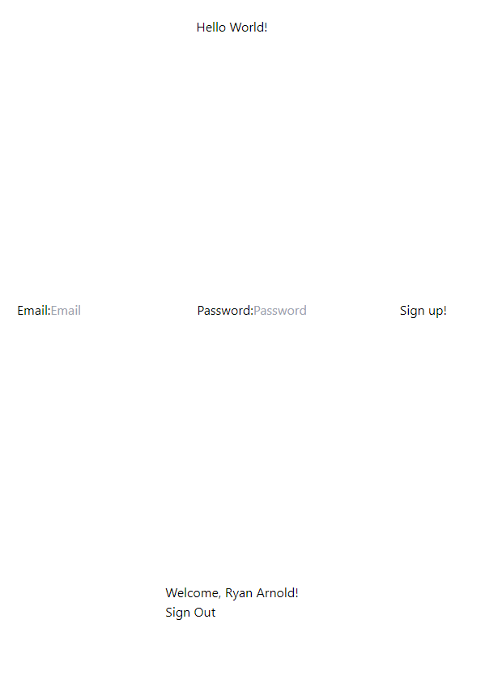

Update your README.md with a brief explanation of your implementation process, highlighting how you integrated Firebase and managed user authentication.
